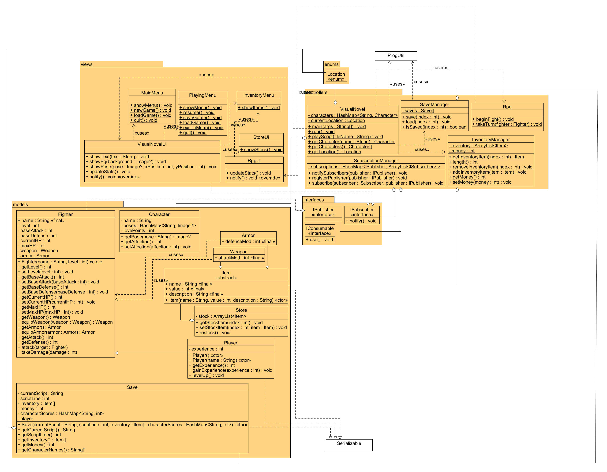

# [ I &amp;#x2764; Code! ]

## Team Members

* Ashley Snell
* Jacob Castro
* Michael Zopff
* Kaedian Maxfield

## Project Description

Dating Simulator
* With multiple routes that one can take
* Targeted Consumers: Lonely Programmers
* Personification of programming languages.

## Part 1: Functional Requirements

### Glossary
* RPG- Role Playing Game
* Dating Simulator- Game where you can date multiple people
* Easter Eggs- Hidden secrets that can be found

### Priority
Each requirement has a priority level of [1], [2], or [3].
1. Must-have functionality critical to the problem solution.
2. Highly desirable feature that should be included.
3. Optional requirements that will be completed if time allows.

* UI
  * Dating Sim[1]
    * Mainly text box with answer buttons that you can click
  * RPG[3]
    * At the end of the dating sim the character that you conquer/choose will become your partner to defeat a single boss
    * The abilities that you have are based on the partner
    * No lvl, no store, no dungeon.
    * If you lose the fight same bad ending from base game
  * Store[2]
    * Can buy various items (if player has enough currency),
    * Items include : gifts(increase love points), flowers(increase love points), food(used in RPG obtained through the game).
  * Inventory
    * User can add  to inventory as well as remove[1]
    * Show sell value of each item[2]
    * Consumables (gifts, flowers, food etc)[1]
    * RPG Equipment (weapons armor etc)[3]
  * Menu[1]
    * Main menu (New game, load Game, exit to desktop)
    * Playing menu(save game, exit to main, exit to desktop)
* Writing
  * Scripts[1]
  * Storyboard[1]
  *  Backgrounds of characters[2]
  * Location[3]
  * Time [3]
  * country[3]
* Art
  * Background of dating sites, school?, home, etc.[3]
  * Characters(see below)
    * Gender-swapped mode[3] (Changes gender of characters)
  * End scene 
    * Main character kissing girl/guy[1]
    * Main character kissing a computer screen with a tear running down cheek.[3] 
* Gameplay
  * Scene Parsing[1]
  * Currency[1]
    * BitCoin(Buy Items)
  * Random Drops/Events[2]
    * Good and bad things.(getting abducted, items, currency, etc.)
  * Store[1](see above)
  * Mini Games for getting currency, items, Love points, etc.[2]
    * Memory cards
    * Quizzes based on the language that you are talking to
  * Fights[3]
    * Turn based you have hp and mana
    * Can use potions and food to heal health or mana
  * Characters:[1]
    * Java 
    * C#
    * C++
    * Python
    * Html & JavaScript (Twins inseparable)
    * (all include name, love points required, favorite gifts etc)
* Saving/Loading Data[1]
  * Game progress(Love points with each character, items in inventory, notes, location, setting, etc.)
* Easter Eggs[3]

## Part 2: Objective Coverage
* The Game will have a GUI 
  * It will implement interfaces for items you can get throughout the game
  * Buttons that will allow the player to choose their own path
  * Mini Games for the player to play allowing them to earn love
  * Character images to show the change in expression of characters
* Items will be abstract so they have bases that are similar but different uses, also is inheritance, and polymorphism.
* We will have a notepad for the character to write notes - File I/O & Data Persistence
* We will have a save/load - Exceptions & Handling 
* HashMap for character poses.
* ArrayList for the inventory.
* MVC is covered, we have models controllers and views.
  * Models for characters and items
  * Controllers for the love point mechanics
    * Gifts increase love points which compare to the love point requirement for love
  * Views to display characters, items, backgrounds, etc
* 2D array list to display store items
* Recursion used in a mini game
* Observer that pays attention to when money changes or love increases/decreases
* Consumable items override the use() method in the Consumable interface.
* Overloading using two constructors for the player

## Part 3: Basic Design

## Part 4: Project Plan
1. By Monday the 26th start coding.
2. By Wednesday the 28th, have the GUI backbones done, menus done.
3. By Friday the 2nd, have Inventory items created and store created, be able to save and load, have currency.
4. By Friday the 2nd, have most of the story done.
5. By Monday the 5th, have mini games set up and working, along with rewards.
6. By Wednesday the 7th, have random events when moving between areas.
7. By Friday the 9th, have art work done and showing.
8. By Monday the 12th, have a finished product!
9. If time permits accomplish things that are marked as priority 3.
